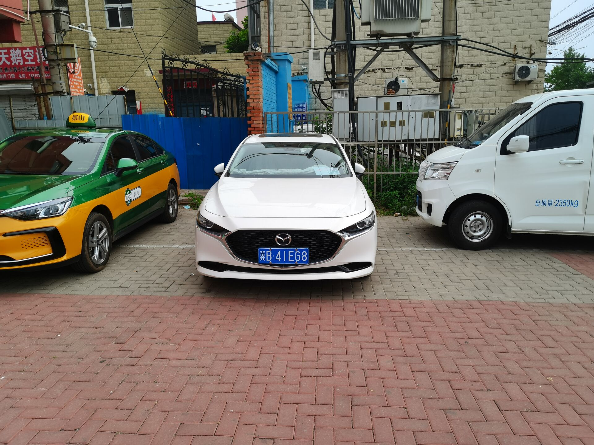
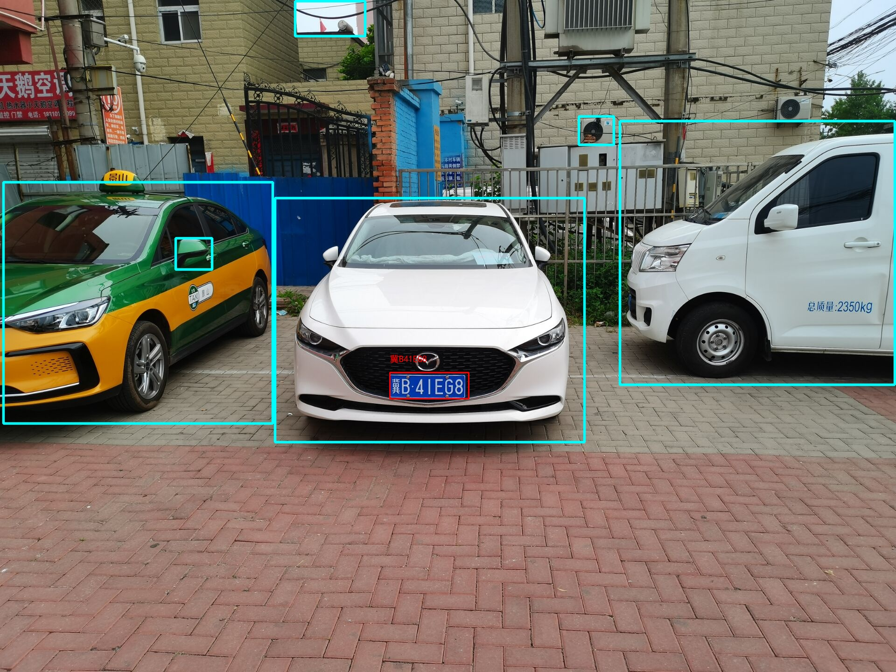
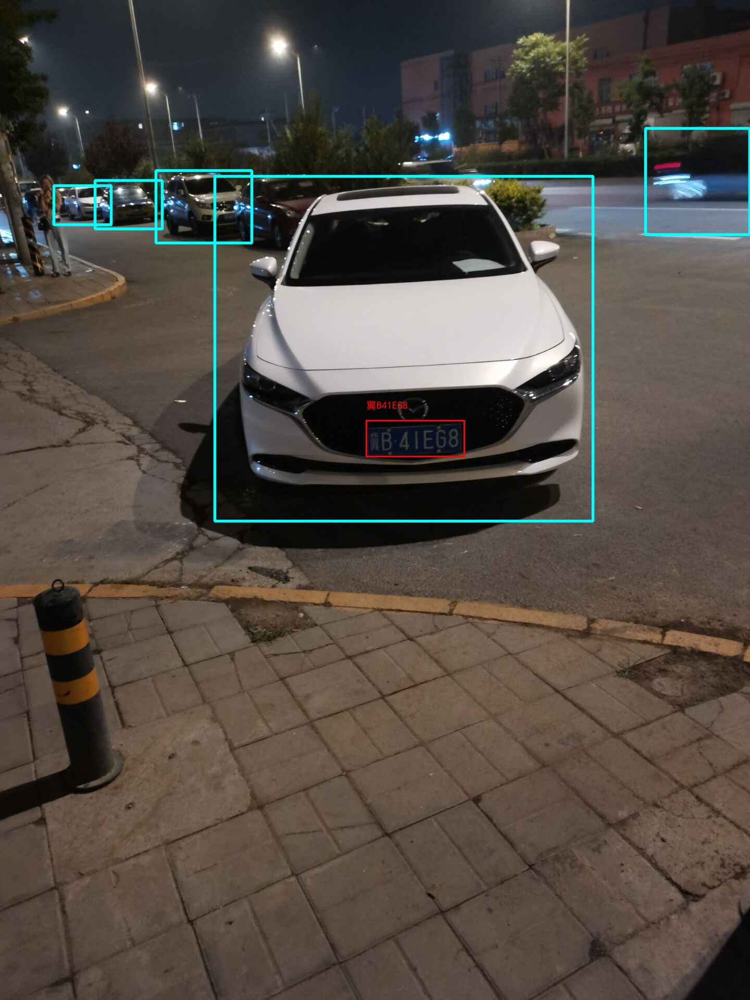

# 功能

车牌检测识别

# 特点

找到车牌在图像的位置，并对车牌进行ocr识别

# 效果

# 应用

## 1.应用场景

车牌识别，车牌检测

## 2.输入输出

#### 输入：

{"imageId": "xxxx", "base64Data":"xxxx", "format": "jpg", "url":"xxxxx"}

#### 输出：

{"status":0, "message": "success", "result_lp_chines": ["陕D5G758",,,],"result_lp_xys":[(x1,y1,x2,y2),,,]}

